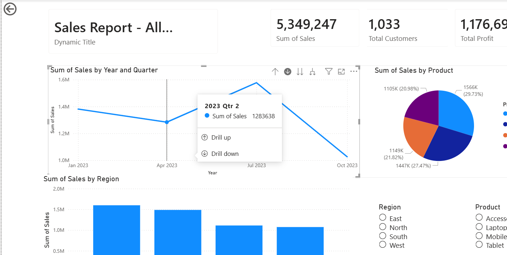

# 📊 Power BI Dashboard for Seminar on Data Visualization

## 📌 Overview

This repository contains the materials and dashboard used for a seminar on **“Data Visualization Techniques in Power BI: Updates, Motion, and Interactivity.”**

As part of the seminar, I designed and presented a **Power BI dashboard** to demonstrate key visualization concepts in a **live, interactive manner**, enabling better understanding compared to static slides.

---

## 📸 Dashboard Preview

> *This screenshot represents the interactive dashboard used during the seminar to demonstrate visualization concepts.*

---

## 🎯 Seminar Objective

The goal of the seminar was to:

* Explain core data visualization concepts in Power BI
* Demonstrate how dashboards support **data storytelling**
* Provide a **hands-on understanding** using real-time interactions

---

## 🧠 Role of the Dashboard During the Seminar

During the seminar, the dashboard was used as a **live demonstration tool** to visually explain concepts presented in the slides .

### 🔹 Updates → KPI Cards

* Demonstrated how KPI values change dynamically with filters
* Explained **data refresh and real-time updates**

### 🔹 Transitions → Slicer Interaction

* Applied slicers to show smooth visual transitions
* Improved storytelling and clarity

### 🔹 Motion → Drill-Down

* Demonstrated hierarchical navigation (Year → Month → Day)
* Showed how data evolves across levels

### 🔹 Interactivity → Slicers & Filters

* Enabled dynamic user interaction
* Showed customized data exploration

### 🔹 Layout Explanation

* Structured as:

  * **Top:** KPI summary
  * **Middle:** Trends
  * **Bottom:** Detailed insights

### 🔹 Remapping → Charts

* Same data represented using multiple visuals
* Highlighted importance of visualization choice

### 🔹 Export Functionality

* Demonstrated exporting to PDF/PPT
* Showed report sharing capabilities

---

